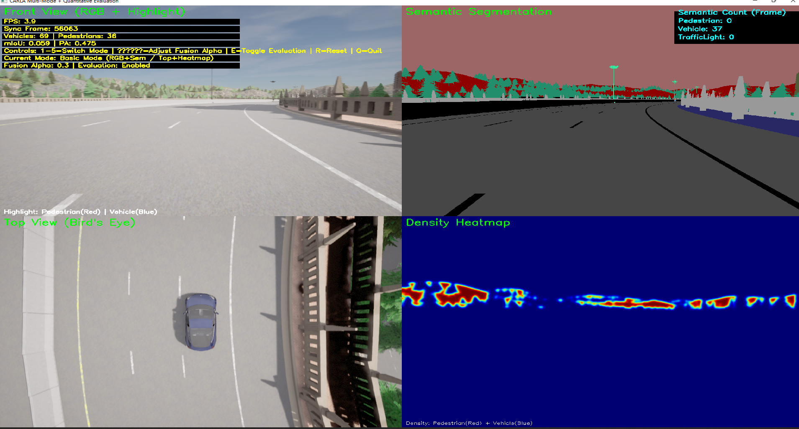
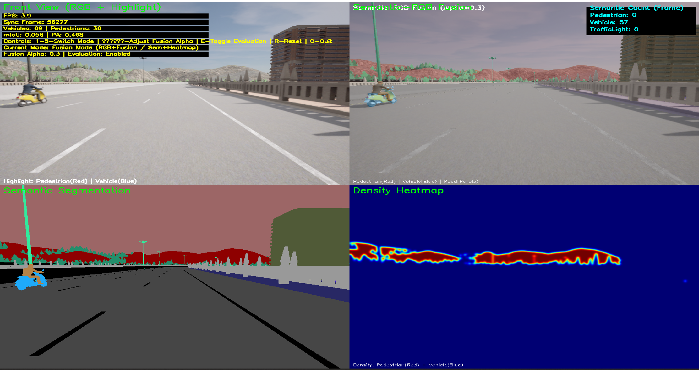
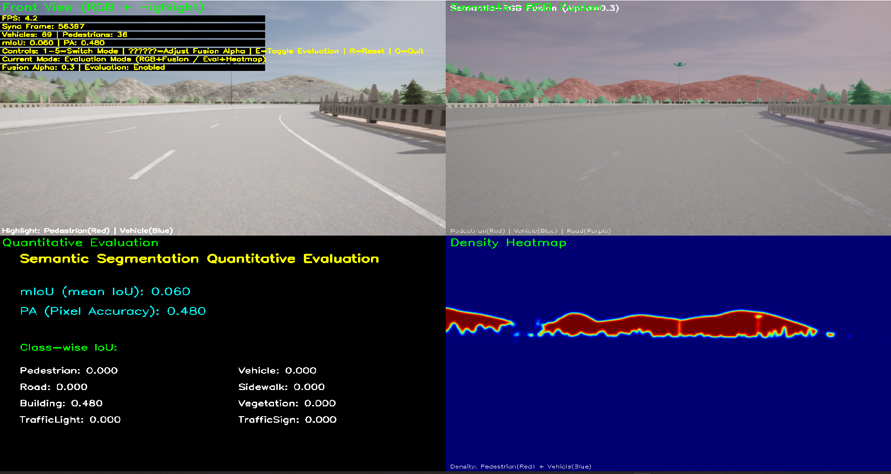
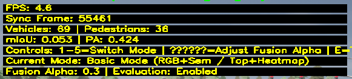

# CARLA 语义分割模块修改

基于 CARLA 自动驾驶仿真平台，对原有语义分割模块进行修改：

- 原始：使用 CARLA 语义标签（Ground Truth）
- 修改：使用神经网络进行预测（CNN）

实现了从“标签驱动”到“模型驱动”的转换。

---

## 修改记录

* 替换语义分割数据来源（GT → 模型预测）
* 新增 CNN 推理流程
* 实现 RGB → 模型 → 分割结果
* 更新 pred_sem_data 来源
* 新增输入预处理（resize + tensor）
* 新增输出处理（argmax + resize）
* 集成模型到 CARLA 主循环
* 启用真实 mIoU 评估

---

##  实验结果

### 基础模式



### 融合模式



### 多模态视角



### 评估结果（mIoU / PA）


---

## 结果说明

- mIoU = 0.053（较低）
- 原因：模型未训练，仅进行随机推理
- 说明：当前结果为真实模型输出，而非Ground Truth

---

## 实验结论

本实验完成：

- 成功替换语义分割模块
- 实现神经网络推理接入
- 完成真实预测流程
- 实现定量评估（mIoU）

验证了模型在 CARLA 仿真中的可行性。

## 核心代码修改

本实验将 CARLA 原始语义标签替换为模型预测结果：

```python
with torch.no_grad():
    pred = model(input_tensor)
    pred = torch.argmax(pred, dim=1).squeeze().cpu().numpy()

pred_sem_data = cv2.resize(pred.astype(np.uint8), (1024, 720), interpolation=cv2.INTER_NEAREST)

front_sem_data = pred_sem_data
