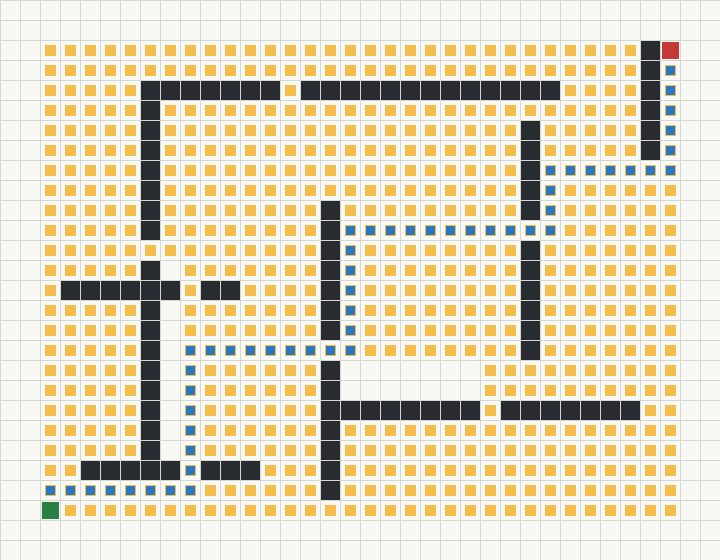
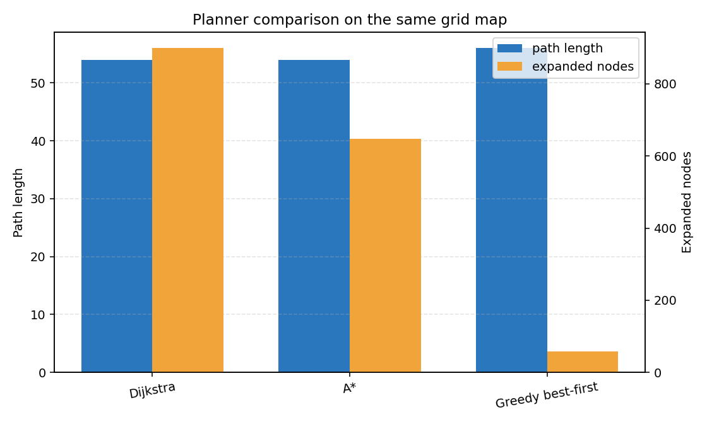
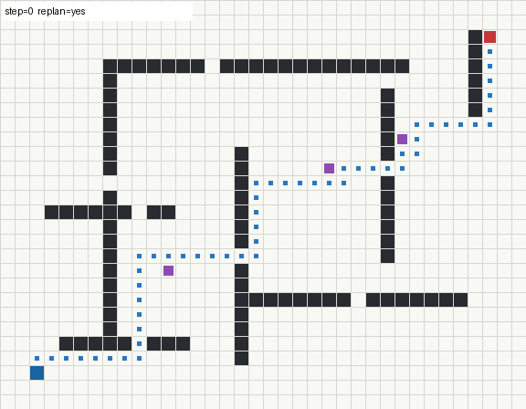

# 自适应栅格导航与动态重规划汇报

## 1. 项目背景

`nn` 项目中包含大量无人车、无人机和机器人导航相关模块。为了让本次改进更接近真实工程项目，我新增了 `adaptive_grid_navigation` 模块，用二维栅格地图模拟移动机器人导航任务。

该模块不依赖 Carla、AirSim、Mujoco 等大型仿真平台，可以直接在普通 Python 环境中运行，适合课堂展示、算法对比和后续迁移到机器人仿真平台。

## 2. 项目目标

本项目的目标是制作一个完整的路径规划演示工程，而不是只写一个单独函数。它包括：

- 栅格地图建模。
- 多种路径规划算法实现。
- 动态障碍物模拟。
- 在线重规划机制。
- 图片、图表和 GIF 动图输出。
- 指标文件和测试文件。
- README 与 MkDocs 汇报文档。

## 3. 新增模块位置

```text
src/adaptive_grid_navigation/
```

模块结构如下：

```text
src/adaptive_grid_navigation/
├── main.py                  # 命令行入口
├── grid_map.py              # 栅格地图与地图生成
├── planners.py              # Dijkstra、A*、贪心搜索规划器
├── simulator.py             # 动态障碍物和在线重规划仿真
├── visualization.py         # 图片、图表和 GIF 输出
├── requirements.txt         # 模块依赖
├── README.md                # 模块说明
├── assets/                  # 运行结果图片、动图和指标
└── tests/test_navigation.py # 基础测试
```

## 4. 核心功能

### 4.1 栅格地图建模

模块使用二维数组表示地图：

- `0` 表示可通行区域。
- `1` 表示障碍物。
- 使用 `(row, col)` 表示机器人位置。
- 地图包含起点 `start` 和终点 `goal`。

`grid_map.py` 中封装了 `GridMap` 类，提供边界检查、障碍物检查、邻居节点搜索和演示地图生成。

### 4.2 多算法路径规划

`planners.py` 中实现了三种规划器：

- `DijkstraPlanner`：保证最短路径，但搜索节点较多。
- `AStarPlanner`：加入启发式函数，通常比 Dijkstra 更高效。
- `GreedyBestFirstPlanner`：搜索速度快，但路径不一定最短。

三种算法使用同一张地图进行比较，便于观察路径长度和扩展节点数量差异。

### 4.3 动态障碍物与在线重规划

`simulator.py` 中实现了动态障碍物。障碍物会沿预设轨迹移动，当障碍物挡住机器人下一步路径时，机器人会从当前位置重新调用 A* 规划路径。

这个机制模拟了真实导航任务中常见的问题：环境不是完全静态的，机器人需要根据障碍物变化调整路径。

## 5. 运行方法

进入模块目录：

```bash
cd src/adaptive_grid_navigation
python main.py
```

运行后会在 `assets/` 目录生成：

```text
astar_route.png
planner_comparison.png
dynamic_replanning.gif
metrics.json
planner_metrics.csv
```

## 6. 运行结果

### 6.1 A* 路径规划结果

下图展示了 A* 在二维栅格地图中的规划路径。深色区域为障碍物，蓝色路径为规划结果，绿色为起点，红色为终点。



### 6.2 不同算法对比

下图比较了 Dijkstra、A* 和 Greedy best-first search 的路径长度和扩展节点数量。



本次运行结果如下：

```text
Dijkstra: path_length=54, expanded_nodes=899
A*: path_length=54, expanded_nodes=648
Greedy best-first: path_length=56, expanded_nodes=58
```

可以看到：

- Dijkstra 与 A* 都找到了长度为 54 的路径。
- A* 在保持最短路径的同时，扩展节点数量少于 Dijkstra。
- 贪心搜索扩展节点最少，但路径长度变为 56，不是最优路径。

### 6.3 动态重规划 GIF

下图展示了机器人在动态障碍物环境中的在线重规划过程。紫色块表示动态障碍物，蓝色块表示机器人当前位置，蓝色路径会随着重规划更新。



本次动态仿真结果：

```text
reached_goal=True
replans=2
travelled=54
frames=55
```

说明机器人成功到达目标点，并在途中进行了 2 次重规划。

## 7. 工程量说明

本模块不是单个脚本，而是一个完整的小型工程，包含：

- 5 个 Python 源码文件。
- 1 个 README 文档。
- 1 个 requirements 依赖文件。
- 1 个测试文件。
- 3 个可视化成果文件。
- 2 个指标输出文件。
- 1 个 MkDocs 汇报页面。

相比只改一两行代码，这个模块更接近 `src` 中其他同学提交的独立项目形式。

## 8. 测试验证

已完成 Python 语法检查：

```bash
python -m py_compile main.py grid_map.py planners.py simulator.py visualization.py tests/test_navigation.py
```

模块运行命令：

```bash
python main.py --output assets --max-steps 120
```

运行结果：

```text
Adaptive grid navigation demo finished
Map: demo  Start: (25, 2)  Goal: (2, 33)
Dijkstra: success=True path_length=54 expanded_nodes=899
A*: success=True path_length=54 expanded_nodes=648
Greedy best-first: success=True path_length=56 expanded_nodes=58
Dynamic replanning: reached_goal=True replans=2 travelled=54 frames=55
```

## 9. 项目意义

该模块可以作为后续机器人导航项目的基础：

- 可以把栅格地图替换成真实仿真地图。
- 可以把 A* 规划结果发送给 ROS、Gazebo 或 Webots 机器人。
- 可以继续加入路径平滑、速度规划和动态窗口法。
- 可以把动态障碍物替换成仿真环境中的行人或车辆。

## 10. 小结

本次新增的 `adaptive_grid_navigation` 模块完成了从地图建模、路径规划、动态避障、重规划、结果可视化到测试验证的完整流程。

它既有算法实现，也有工程组织和可视化成果，适合作为课程汇报项目展示。
