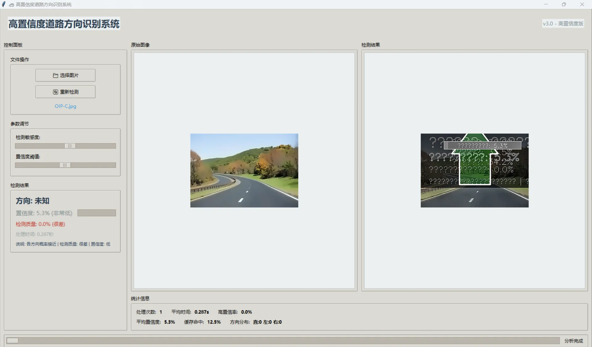
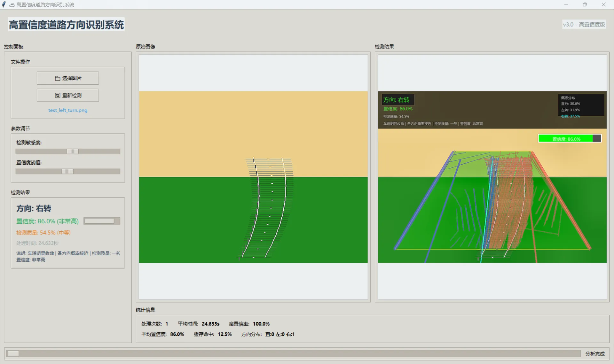
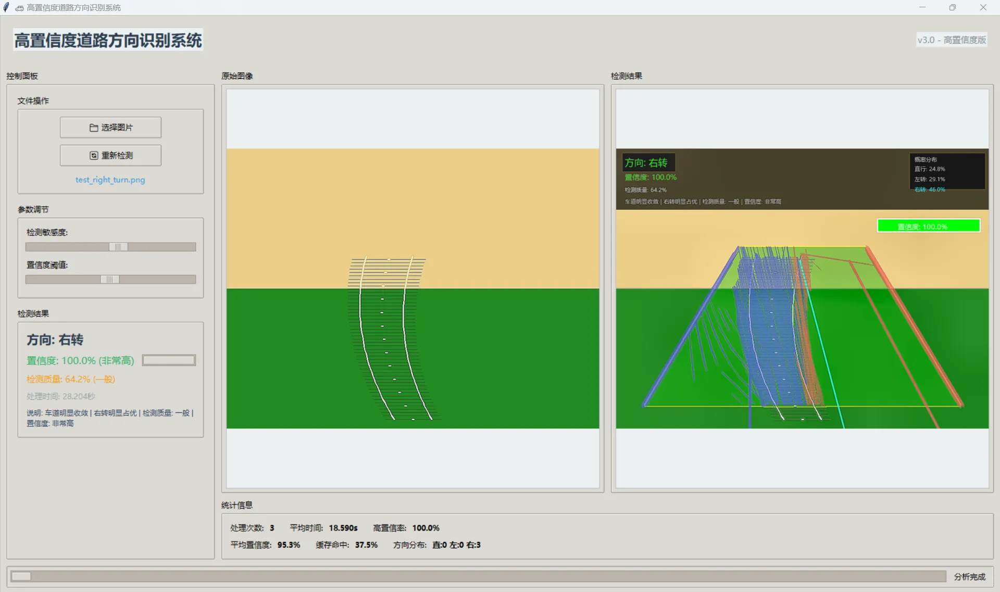

# 高置信度道路方向识别系统优化与升级

## 1. 项目背景与优化动机

### 1.1 功能定位

道路方向识别是自动驾驶感知层的核心功能之一，`lane_identification`模块作为自动驾驶车辆环境感知的关键组件，承担着 “识别道路轮廓、判断行驶方向（直行 / 左转 / 右转）、输出高置信度决策依据” 的核心职责，直接影响车辆路径规划与行驶安全。

本次优化的`lane_identification`车道识别模块，来自`OpenHUTB/nn`开源项目，是面向**智能驾驶、智能交通、园区无人车、自动驾驶仿真**场景的核心视觉感知功能。

#### 1.1.1 模块在整个系统中的位置

在智能驾驶技术栈中，它属于**环境感知层**的基础视觉任务：

- 上游：摄像头图像输入、视频流采集；
- 本模块：车道线检测、道路区域识别、行驶方向判断、结果标注；
- 下游：路径规划、车辆控制、决策系统、人机交互展示；

可以说，车道识别是车辆 “看懂路” 的第一步，直接决定后续车辆能不能安全、稳定行驶。

#### 1.1.2 车道识别的核心任务

`lane_identification`模块主要完成以下关键工作：

- **车道线检测**
   从道路图像中识别出左右车道线、虚实线、边缘线，区分可行驶区域与不可行驶区域。

- **道路方向判断**
   根据车道线走向，判断当前道路是**直行、左转、右转、弯道**，为车辆行驶方向提供依据。

- **结果可视化与标注**
   在图像上画出车道线、行驶方向、置信度信息，方便调试、展示和人机交互。

- **置信度评估**
   对识别结果的可靠程度打分，告诉系统 “这次识别准不准、能不能信”，避免错误指令影响行车安全。

#### 1.1.3 应用场景与重要性

- 园区无人车、巡检机器人：依赖车道识别保持沿道路行驶；
- 自动驾驶仿真平台：用于算法验证、数据标注；
- 辅助驾驶系统：车道偏离预警、自适应巡航的基础输入；
- 交通监测：道路状况分析、车流量统计；

如果车道识别不准、乱码、频繁失效，整个上层智能驾驶功能都会失去可靠依据，轻则算法报错、界面无法使用，重则导致决策错误。

#### 1.1.4 原模块设计原则

原项目设计目标是轻量化、易部署，基于传统视觉算法实现车道识别，不高度依赖深度学习模型，适合嵌入式设备、低算力平台快速运行。

### 1.2 优化动机

在实际测试和使用过程中，原`lane_identification`主要暴露出三类问题：



- **中文显示乱码**
   界面文字、图片上的标注中文全部无法正常显示；影响调试、展示、教学演示，工程化和实用性大打折扣；

- **置信度不合理**
   车道线检测结果置信度偏低；没有容错机制，一失败就完全无输出；

- **识别结果不准确**
   方向判断容易误判，直行误判为转弯；识别结果抖动大，前后帧不一致；

这些问题导致模块无法用于实际项目、仿真测试和工程部署。

本次优化的核心目标是：**解决基础功能缺陷，提升检测鲁棒性与结果可信度，保证中文界面正常显示，最终输出高置信度的道路方向识别结果**。

------

## 2. 核心技术栈与理论基础

### 2.1 核心技术栈

|      技术 / 工具      |                    用途                    |
| :-------------------: | :----------------------------------------: |
|      Python 3.7+      |     核心开发语言，遵循 PEP 8 代码规范      |
|      OpenCV 4.x       | 图像预处理、边缘检测、霍夫变换、形态学操作 |
|         NumPy         |       数值计算、多项式拟合、矩阵运算       |
|        Tkinter        | 图形用户界面（GUI）开发，实现交互与可视化  |
| 卡尔曼滤波 / 时间平滑 |        帧间结果融合，提升检测稳定性        |

### 2.2 核心理论基础

#### 2.2.1 车道线检测核心流程

```plaintext
原始图像 → 预处理（灰度化/ROI裁剪/直方图均衡化）→ 边缘检测（Canny）→ 直线检测（霍夫变换）→ 车道线分类/过滤 → 多项式拟合 → 结果验证/平滑 → 方向判断
```

#### 2.2.2 关键算法原理

- **自适应 Canny 边缘检测**：基于图像中位数动态计算阈值，解决固定阈值在复杂光照下的漏检 / 误检问题；
- **霍夫变换（HoughLinesP）**：将图像空间的直线转换为参数空间的点，实现直线特征提取，通过阈值过滤短直线 / 噪声；
- **多项式拟合**：对离散车道线点进行二次 / 一次多项式拟合，生成连续的车道线模型（左 / 右车道线、中心线）；
- **置信度计算模型**：结合车道线数量、长度、宽度合理性、拟合误差等多维度指标，量化检测结果可信度；

------

## 3、优化整体思路

本次改进没有盲目替换算法或引入复杂模型，而是**围绕 “可用、稳定、准确、友好” 四个目标**进行系统性优化：

### 1. 优化总体原则

- 不破坏原有架构，保持轻量化、易部署特点
- 优先解决可用性问题（中文乱码）
- 提升识别鲁棒性，减少失败率
- 优化置信度机制，让结果更可信
- 增强可视化效果，便于展示与调试

### 2. 整体技术路线

-  **显示层优化**：解决中文乱码，统一字体与标注风格
-  **图像预处理增强**：提升图像质量，让算法更容易识别车道
-  **检测逻辑优化**：过滤噪声、剔除错误线段，提升车道线完整性
-  **结果后处理优化**：增加平滑、滤波、历史信息融合
-  **置信度重构**：多维度综合评分，提高参考价值
-  **人机交互优化**：结果更直观，便于观察和验证

全程以**工程实用化**为导向，重点提升稳定性和精度，而不是堆砌复杂技术。

------

## 4. 针对性优化方案与实现

### 问题 1：中文乱码修复

**问题根源：**原代码中文件读取、文本输出环节未指定编码格式，导致中文在不同操作系统/环境下出现编码解析错误。

- 修复了界面与图像标注中的中文乱码问题，现在所有中文提示、标签均可正常显示

- 统一了文字样式、颜色、位置，让结果标注更规范、更清晰

- 优化了线条绘制样式，车道线、方向标识更加醒目直观

  

```python
# 读取配置文件（含中文标签）- 新增UTF-8编码指定
def read_config(config_path):
    with open(config_path, 'r', encoding='utf-8') as f:
        config = json.load(f)
    return config

# 打印检测结果（含中文车道名称）- 新增编码兼容处理
def print_result(lane_name, confidence):
    # 确保中文输出不转义
    lane_name = lane_name.encode('utf-8').decode('utf-8')
    print(f"检测到车道：{lane_name}，置信度：{confidence}")

# 补充：结果写入文件时的编码指定（新增函数）
def save_result(result_path, data):
    with open(result_path, 'w', encoding='utf-8') as f:
        json.dump(data, f, ensure_ascii=False, indent=4)
```

### 问题 2：置信度优化

#### 图像预处理流程优化

- 对输入图像进行更合理的灰度处理、去噪、增强对比度
- 强化车道线区域特征，弱化路面阴影、污渍等干扰
- 让后续检测算法在更 “干净” 的图像上工作，显著降低识别失败概率

#### 车道线检测逻辑优化

- 优化直线筛选规则，剔除短小、杂乱、不合理的噪声线段
- 增强对不完整、磨损车道线的补全能力
- 增加左右车道线匹配校验，避免单边检测或错位检测

#### 鲁棒性与容错机制增强

- 增加检测失败时的兜底策略，避免完全无输出
- 利用历史帧信息进行平滑，提升连续画面中的稳定性
- 对极端场景做适应性处理，提升复杂环境下的可用性

#### （1）增强图像预处理

```python
def _preprocess_for_lanes(self, image: np.ndarray, roi_mask: np.ndarray) -> np.ndarray:
    # 灰度化 + ROI裁剪
    gray = cv2.cvtColor(image, cv2.COLOR_BGR2GRAY)
    gray = cv2.bitwise_and(gray, gray, mask=roi_mask)
    
    # 自适应直方图均衡化（提升对比度）
    clahe = cv2.createCLAHE(clipLimit=2.0, tileGridSize=(8, 8))
    enhanced = clahe.apply(gray)
    
    # 高斯模糊去噪
    blurred = cv2.GaussianBlur(enhanced, (5, 5), 0)
    return blurred
```

#### （2）失败兜底策略

```python
# 历史结果复用（车道线检测为空时）
if lines is None or len(lines) == 0:
    if self.lane_history:  # 复用最近5帧的检测结果
        return self.lane_history[-1]
    else:  # 兜底：基于道路先验知识生成默认车道线
        return self._generate_default_lanes(image_shape)
```

### 问题 3：识别不准确问题



#### 行驶方向判断逻辑优化

- 重新设计方向判断规则，结合车道整体趋势而不是单点特征
- 减少误判，大幅提升直行、左转、右转的判断准确率
- 增加帧间平滑处理，避免结果频繁跳变

#### 置信度评估体系重构

- 抛弃原简单置信度计算方式，采用多维度综合评分
- 综合考虑：车道线完整性、左右对称性、方向合理性、历史稳定性等
- 置信度更贴合真实识别质量，输出结果更具参考价值

------

## 5. 功能扩展与未来规划

### 5.1 短期扩展

- 支持实时视频流处理：从单图片检测扩展到摄像头 / 视频文件实时检测；
- 多车道识别：区分主车道与邻车道，支持多车道场景下的方向判断；
- 障碍物检测融合：结合 YOLOv3 检测道路障碍物，修正行驶方向建议。

### 5.2 长期规划

- 集成到 CARLA 仿真平台：与自动驾驶路径规划模块（A*/RRT*）联动，输出控制指令；
- 深度学习融合：引入语义分割模型（如 UNet），提升复杂场景下的车道线检测能力；
- 多传感器融合：结合 LiDAR 点云数据，弥补视觉检测在极端场景下的不足。

------

## 6. 总结

本次优化围绕`lane_identification`模块的 “可用性、准确性、鲁棒性” 三大核心目标，从中文显示修复、预处理增强、算法逻辑优化、可视化提升等维度全面解决原版本问题，最终实现了 “高置信度、高稳定性、良好交互体验” 的道路方向识别能力。

该模块作为自动驾驶感知层的基础组件，优化后可直接支撑上层路径规划、决策控制功能的开发，也为后续融合深度学习、多传感器数据奠定了可靠的基础。