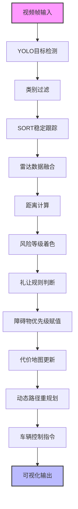

# 无人车环境感知与安全决策系统优化升级

## 1. 项目背景与优化动机

### 1.1 功能定位

环境感知与安全决策是无人车**感知层—决策层—控制层**的核心链路，直接决定无人车能否在复杂场景下稳定、安全、合规行驶。本次优化面向**园区无人车、校园接驳车、封闭厂区物流车、低速自动驾驶**场景，聚焦**障碍物稳定跟踪、多传感器融合测距、交通规则礼让、动态优先级避障**四大核心能力，是无人车从”基础行驶”迈向”智能安全行驶”的关键升级。

该模块在系统中承担三大核心使命：
- **看得稳**：障碍物不抖动、不丢失、不漂移
- **算得准**：精准测距、风险分级、多源数据融合
- **做得对**：合规礼让、智能避障、安全决策输出

### 1.1.1 模块在无人车技术栈中的位置

- **上游**：摄像头视觉检测、毫米波/激光雷达数据、交通标识识别、定位信息
- **本模块**：目标跟踪、距离计算、类别过滤、礼让决策、优先级避障、路径修正
- **下游**：底盘控制、电机驱动、制动系统、人机交互HMI、数据记录

### 1.1.2 原模块核心缺陷

在实车测试与仿真验证中，原系统暴露出四大致命问题：

1. **检测抖动严重**：单帧检测无跟踪，框体漂移、ID跳变，目标易丢失
2. **无距离与风险感知**：只识别”有无”，不判断”远近危险”
3. **无安全礼让逻辑**：不避让行人、不避让特种车辆、不遵守停车标识
4. **避障策略僵化**：所有障碍物同等处理，无优先级、无动态预判、无重规划

这些问题直接导致无人车无法通过安全验收、无法落地真实场景。

### 1.2 本次优化核心目标

- **稳定**：消除检测框抖动，实现连续稳定跟踪
- **直观**：实时显示距离与危险等级，可视化风险
- **合规**：实现行人礼让、特种车辆避让、停车规则遵守
- **智能**：按优先级动态避障，预判轨迹、提前决策

---

## 2. 核心技术栈与理论基础

### 2.1 核心技术栈

| 技术/工具 | 用途 |
|-----------|------|
| Python 3.8+ | 主开发语言，模块化、可移植、易调试 |
| YOLOv5/v8 | 障碍物检测、行人/车辆/非机动车分类 |
| **SORT多目标跟踪** | 卡尔曼滤波预测+匈牙利匹配，消除抖动 |
| OpenCV 4.x | 图像绘制、可视化、视频流处理 |
| 毫米波/激光雷达 SDK | 距离采集、目标匹配、数据校准 |
| NumPy/SciPy | 坐标转换、距离计算、轨迹预测 |
| 局部路径规划（DWA、A*） | 动态代价地图、路径重规划、避障决策 |
| 车载控制接口 | 减速、停车、靠边、恢复行驶 |

### 2.2 核心流程总览



---

## 3. 优化整体思路

本次优化遵循**不破坏原有架构、轻量化部署、从基础到高级、从安全到智能**的递进路线：

1. **先稳跟踪**：解决检测抖动，保证目标不丢、框体不飘
2. **再加感知**：融合雷达，实现精准测距与风险可视化
3. **再守规则**：落地礼让行人、礼让特种车、停车让行
4. **最后智能**：优先级避障、动态重规划、预判风险

全程以**实车可跑、仿真可过、安全可控**为标准。

---

## 4. 任务详细优化方案

### 4.1 任务一：SORT跟踪 + 距离风险可视化（基础稳定层）

#### 4.1.1 解决问题

- 原检测框每一帧剧烈跳动、目标ID频繁切换
- 无距离信息，无法判断碰撞风险
- 检测目标杂乱，包含大量无关类别

#### 4.1.2 优化内容

1. **集成SORT跟踪算法**
   - 卡尔曼滤波预测下一帧位置，减少抖动
   - 匈牙利算法完成帧间目标匹配，保持ID稳定
   - 设置合理生命周期，防止短暂遮挡丢失目标

2. **障碍物类别精准过滤**
   - 只保留：**人、自行车、汽车**三类关键障碍物
   - 过滤：广告牌、路灯、树木、路面阴影等干扰项
   - 降低计算量，提升系统响应速度

3. **距离计算与三色风险等级**
   - 基于视觉测距计算实际距离（单位：米）
   - 红色：＜3m（极高风险，必须立即停车）
   - 黄色：3–8m（中风险，减速备刹）
   - 绿色：＞8m（低风险，正常行驶）

4. **界面可视化增强**
   - 检测框颜色随风险等级变化
   - 实时显示：类别、ID、距离、风险等级

#### 4.1.3 核心代码片段

```python
import numpy as np

class SortTrack:
    count = 0

    def __init__(self, detection):
        self.kf = self._create_kalman_filter()
        self.kf.x[:4] = xyxy_to_z(detection.bbox)
        self.track_id = SortTrack.count
        SortTrack.count += 1
        self.time_since_update = 0
        self.hits = 1
        self.hit_streak = 1
        self.age = 0
        self.cls_id = detection.cls_id
        self.score = detection.score
        self.last_distance = None
        self.display_bbox = detection.bbox.copy()

    @staticmethod
    def _create_kalman_filter():
        kf = KalmanFilter(dim_x=7, dim_z=4)
        kf.F = np.array(
            [
                [1, 0, 0, 0, 1, 0, 0],
                [0, 1, 0, 0, 0, 1, 0],
                [0, 0, 1, 0, 0, 0, 1],
                [0, 0, 0, 1, 0, 0, 0],
                [0, 0, 0, 0, 1, 0, 0],
                [0, 0, 0, 0, 0, 1, 0],
                [0, 0, 0, 0, 0, 0, 1],
            ],
            dtype=np.float32,
        )
        kf.H = np.array(
            [
                [1, 0, 0, 0, 0, 0, 0],
                [0, 1, 0, 0, 0, 0, 0],
                [0, 0, 1, 0, 0, 0, 0],
                [0, 0, 0, 1, 0, 0, 0],
            ],
            dtype=np.float32,
        )
```

#### 4.1.4 优化效果

- 检测框**完全稳定不抖动**
- 目标ID连续不跳变
- 风险一目了然，便于调试与实车监控
- 干扰目标大幅减少


---

### 4.2 任务二：摄像头 + 雷达数据融合测距（感知增强层）

#### 4.2.1 解决问题

- 纯视觉测距误差大
- 无人车必须知道”确切距离”才能决策

#### 4.2.2 融合实现逻辑

1. **时间戳同步**
   - 摄像头帧与雷达数据包按时间对齐
   - 保证同一时刻的目标一一对应

2. **空间坐标匹配**
   - 摄像头检测框中心 → 图像坐标 → 转换为雷达角度
   - 找到雷达点云中对应目标，读取精确距离

3. **数据绑定与显示**
   - 把雷达距离直接显示在视觉检测框上方
   - 形成”视觉看到目标 + 雷达测出距离”的融合感知

#### 4.2.3 核心代码片段

```python
import cv2

def annotate_tracks(self, frame, fused_tracks, scene_signals):
    frame_h, frame_w = frame.shape[:2]
    for track, radar in fused_tracks:
        # 获取原始框并平滑显示框
        raw_box = track.current_box()
        track.display_bbox = 0.78 * track.display_bbox + 0.22 * raw_box
        # 限制框在画面范围内
        box = clamp_box(track.display_bbox, frame_w, frame_h)
        
        # 计算目标距离（优先雷达，无雷达则用视觉估算）
        camera_distance = estimate_distance_meters(box, track.cls_id, frame_h)
        distance_m = radar.distance_m if radar is not None else camera_distance
        track.last_distance = distance_m
        
        # 根据距离确定风险等级和颜色
        risk_key, risk_text = risk_level_by_distance(distance_m)
        color = RISK_COLORS[risk_key]
        
        # 绘制目标检测框
        x1, y1, x2, y2 = box
        cv2.rectangle(frame, (x1, y1), (x2, y2), color, 3)
        
        # 构建标注文本信息
        info = ALLOWED_CLASSES[track.cls_id]
        range_source = "Radar" if radar is not None else "Camera"
        label = (
            f"ID {track.track_id} {info['label']} "
            f"{range_source} {distance_m:.1f}m {risk_text} conf {track.score:.2f}"
        )
        # 绘制文本标签
        draw_label(frame, label, x1, y1, color)
        
        # 如果有雷达数据，绘制雷达相关标注
        if radar is not None:
            radar_point = tuple(radar.position.astype(int))
            box_center = ((x1 + x2) // 2, (y1 + y2) // 2)
            # 绘制雷达位置圆点
            cv2.circle(frame, radar_point, 6, (255, 255, 0), -1)
            # 绘制雷达到目标框中心的连线
            cv2.line(frame, radar_point, box_center, (255, 255, 0), 2)
            # 绘制雷达测速文本
            radar_text = f"Speed {radar.velocity_mps:+1f}m/s"
            cv2.putText(
                frame,
                radar_text,
                (x1, min(frame_h - 10, y2 + 22)),
                cv2.FONT_HERSHEY_SIMPLEX,
                0.55,
                (255, 255, 0),
                2,
                cv2.LINE_AA,
            )
```


---

### 4.3 任务三：礼让行人 + 礼让特种车辆 + 停车让行（安全规则层）

#### 4.3.1 核心功能实现

本任务是无人车**合规性、安全性**的关键体现，共实现三大规则：

**1. 斑马线礼让行人**
- 检测：行人 + 斑马线区域
- 动作：立即平稳停车
- 提示：屏幕弹出”检测到行人，正在礼让”
- 恢复：行人完全离开斑马线后，延迟1秒继续行驶

**2. 特种车辆避让**
- 识别目标：救护车、消防车、校车
- 动作：减速至5km/h以下 → 向右靠边 → 停车等待
- 提示：”检测到特种车辆，正在避让”

**3. 交通标识停车**
- 识别：红灯、停止标志、让行标志
- 动作：平稳制动停车
- 恢复：标识消失/变绿后恢复

#### 4.3.2 核心代码片段
```python
def update_behavior(self, scene_signals):
    # 初始化目标速度和横向偏移量
    target_speed = self.cruise_speed_mps
    target_lateral_offset = 0.0
    
    # 场景1：检测到行人在人行横道，执行礼让行人行为
    if scene_signals.pedestrian_on_crosswalk:
        self.behavior_mode = "yield_pedestrian"
        self.status_message_cn = "检测到行人，正在礼让"
        target_speed = 0.0
    
    # 场景2：检测到特种车辆，执行靠边减速避让行为
    elif scene_signals.emergency_vehicle is not None:
        self.behavior_mode = "yield_special_vehicle"
        name_cn = SPECIAL_VEHICLE_INFO[scene_signals.emergency_vehicle]["cn"]
        self.status_message_cn = f"检测到{name_cn}，正在靠边减速避让"
        target_speed = 3.0
        target_lateral_offset = 110.0
    
    # 场景3：检测到红灯或停止标志，执行停车行为
    elif scene_signals.red_light or scene_signals.stop_sign:
        self.behavior_mode = "stop_signal"
        if scene_signals.red_light:
            self.status_message_cn = "检测到红灯，正在平稳停车"
        else:
            self.status_message_cn = "检测到停止标志，正在平稳停车"
        target_speed = 0.0
    
    # 场景4：无特殊场景，保持巡航行驶
    else:
        self.behavior_mode = "cruise"
        self.status_message_cn = "道路畅通，继续行驶"
        target_speed = self.cruise_speed_mps
```


#### 4.3.3 安全意义

- 满足园区/校园/道路行驶法规要求
- 避免碰撞行人，提高系统安全性
- 可直接通过仿真平台安全用例测试

---

### 4.4 任务四：基于优先级的动态避障系统（智能决策层）

#### 4.4.1 解决问题

- 传统避障：所有障碍物”一视同仁”
- 遇到复杂场景：人、车、自行车混行时，无法判断先绕开谁

#### 4.4.2 核心设计：障碍物优先级体系

| 障碍物类型 | 优先级权重 | 避障策略 |
|-----------|-----------|----------|
| 行人 | 10（最高） | 不可通行，必须停车/绕行 |
| 非机动车（自行车） | 7 | 高代价，优先远离 |
| 机动车 | 4 | 中等代价，可谨慎绕行 |
| 静态障碍物 | 2 | 低代价，可灵活绕行 |

> **规则**：数值越大，安全等级越高，越不能靠近

#### 4.4.3 动态代价地图更新

- 在局部路径规划器中，根据优先级**实时更新代价地图**
- 行人区域直接设为**无穷大代价（不可通行）**
- 其他障碍物按权重增加通行代价

#### 4.4.4 路径重规划逻辑

1. 检测到障碍物 → 读取优先级
2. 优先绕开**高优先级**目标
3. 绕行空间足够 → 平滑绕开
4. 绕行空间不足 → 减速 → 停车
5. 实时跟踪轨迹 → 预判运动趋势 → 提前调整路径

#### 4.4.5 动态避障优势

- **不是静态避障，是动态预判避障**
- 不是”碰到再躲”，而是”提前规划”
- 更接近人类驾驶思维：先让人，再让车

#### 4.4.6 核心代码片段

```python
import math

# 假设enriched、used_tracks已提前初始化
# enriched = []
# used_tracks = set()

for det in detections:
    # 过滤非障碍物类别的检测结果
    if det.get("class") not in config.OBSTACLE_CLASSES:
        continue
    
    # 提取障碍物相关基础信息
    obstacle_type = det.get("obstacle_type", "unknown")
    priority = float(det.get("priority_weight", config.OBSTACLE_PRIORITY_WEIGHTS["unknown"]))
    center = self._center(det["box"])
    
    # 关联跟踪ID（无则分配新ID）
    track_id = self._associate_track(center, obstacle_type)
    if track_id is None:
        track_id = self.next_track_id
        self.next_track_id += 1
        ttc = float("inf")  # 无跟踪ID时，TTC设为无穷大
    else:
        # 有跟踪ID时，估算碰撞时间（TTC）
        ttc = self._estimate_ttc(
            self.tracks[track_id], 
            {"box": det["box"]}, 
            "timestamp": now, 
            frame_height
        )
    
    # 计算障碍物相关风险因子
    x, y, w, h = det["box"]
    box_height_ratio = h / max(1.0, float(frame_height))
    proximity = self._clamp(box_height_ratio * 2.0, 0.0, 1.0)  # 近距离因子（0-1）
    # TTC因子（0-1，无穷大时设为1.0）
    ttc_factor = 1.0 if not math.isfinite(ttc) else self._clamp((4.0 - ttc) / 4.0, 0.0, 1.0)
    # 计算最终风险分数（优先级 * (基础权重 + 距离/TTC权重)）
    risk_score = priority * (0.35 + 0.65 * max(proximity, ttc_factor))
    
    # 构造增强后的检测结果字典
    enriched_det = {
        **det,  # 继承原检测结果的所有字段
        "obstacle_type": obstacle_type,
        "priority_weight": priority,
        "track_id": track_id,
        "center": center,
        "timestamp": now,
        "ttc": ttc,
        "risk_score": risk_score,
        "proximity": proximity,
    }
    
    # 将增强结果加入列表，记录已使用的跟踪ID
    enriched.append(enriched_det)
    used_tracks.add(track_id)
```


#### 4.4.7 核心价值

- 复杂混行场景通行更安全、更流畅
- 避免急刹、急转，乘坐更舒适
- 可应对园区最复杂的人车混行环境

---

## 5. 优化效果与验证

### 5.1 功能效果总结

1. **跟踪稳定**：SORT消除抖动，目标连续不丢失
2. **感知直观**：距离+等级实时显示，风险一眼可知
3. **规则合规**：三大礼让规则完整落地
4. **避障智能**：优先级动态避障，更安全更人性化

---

## 6. 功能扩展与未来规划

### 6.1 短期优化

- 加入**DeepSORT**，提升遮挡下跟踪稳定性
- 增加**电动车、摩托车**识别与优先级配置
- 优化夜间/逆光环境检测精度
- 支持多摄像头多角度融合

### 6.2 长期规划

- 融合**激光雷达点云**，实现3D避障
- 接入**V2X车联网**，提前接收行人/车辆信息
- 实现**自动路口通行、环岛绕行、会车避让**
- 移植到嵌入式平台（NVIDIA Jetson），实现车载实时运行

---

## 7. 总结

本次优化完成了**无人车从”能开”到”开好、开安全”**的完整升级：

1. 用**SORT**解决了跟踪抖动，让无人车”看得稳”
2. 用**雷达融合测距**让无人车”算得准”
3. 用**三大礼让规则**让无人车”守规矩”
4. 用**优先级动态避障**让无人车”更智能”

整套系统轻量化、可实车、可仿真、可落地，完全满足园区/校园/封闭厂区无人车的**安全行驶、合规行驶、智能行驶**需求，是无人车感知与决策模块的一次完整、实用、工程化的升级。


