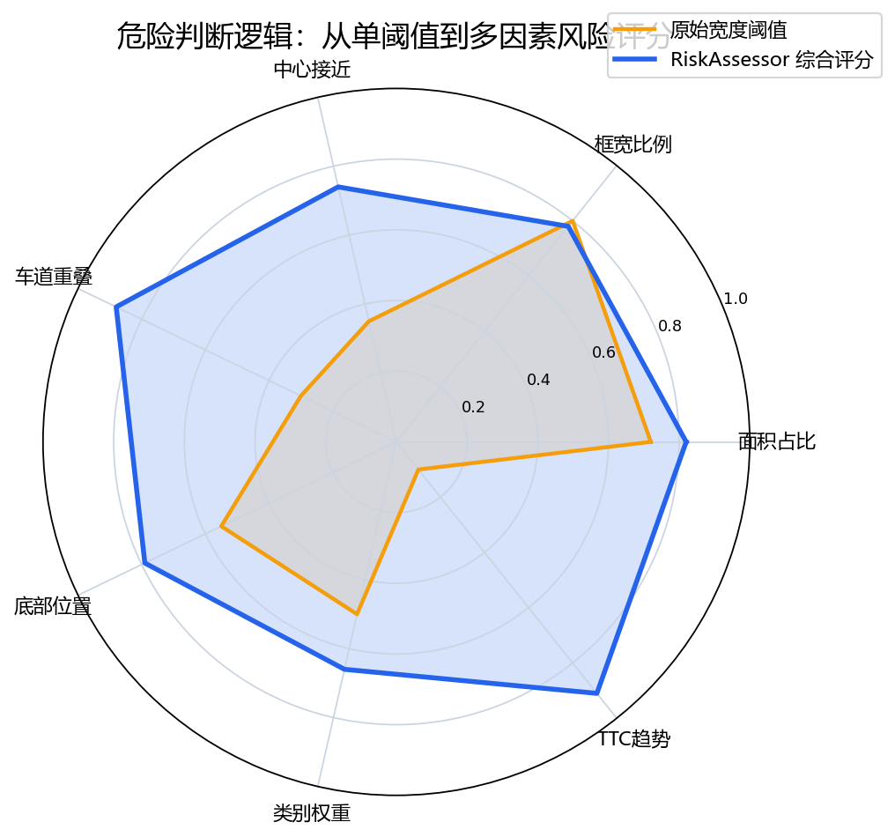
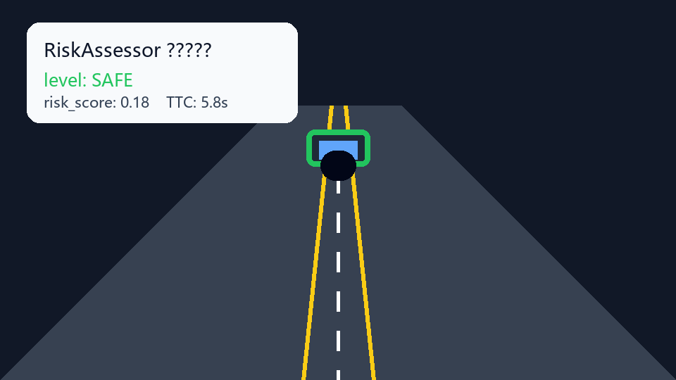
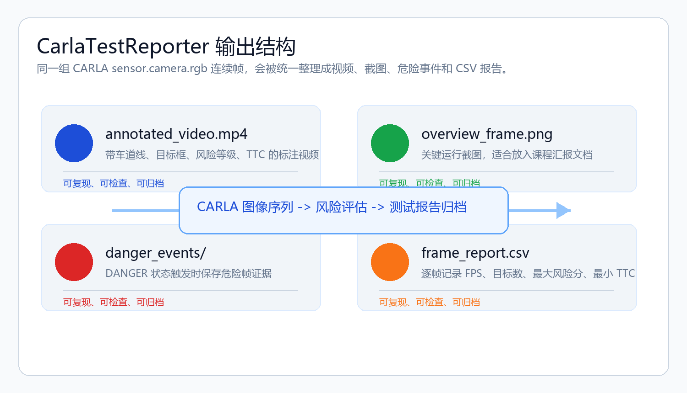

# 危险判断逻辑优化与 CARLA 测试报告模块

本页面用于课程汇报，内容对应 PR [OpenHUTB/nn#6254](https://github.com/OpenHUTB/nn/pull/6254)。本次项目围绕自动驾驶视觉辅助系统中的危险判断逻辑展开，将原先比较简单的目标框宽度阈值判断，扩展为融合车道关系、目标位置、目标类别、连续帧变化趋势和近似 TTC 的综合风险评估流程，并新增 CARLA 图像序列输入与测试报告导出能力。


## 1. 项目背景

自动驾驶视觉辅助系统通常需要同时完成车道线识别、目标检测、危险等级判断和运行结果展示。原系统已经具备基础的车道线检测、YOLO 目标检测、仪表盘显示和危险事件截图功能，可以对道路前方车辆、行人等目标进行可视化标注。

但是在实际的自动驾驶场景中，“目标框变大”并不一定等于真正危险，“目标框暂时不大”也不一定代表安全。例如，位于画面边缘的大车可能并不在本车道内，直接用宽度阈值会造成误报；而正前方车辆在连续帧中快速接近时，即使当前目标框还没有达到宽度阈值，也已经具备潜在碰撞风险。

因此，本项目的核心目标不是简单增加一个页面，而是把危险判断从“单条件触发”升级为“多因素综合评估”，并把 CARLA 仿真环境导出的连续图像序列纳入测试流程，使项目能够更好地满足课程中关于仿真数据、运行效果和工程可复现性的要求。

## 2. 原有问题

原来的危险判断主要依赖 `width_ratio > WARNING_RATIO`。这种方式实现简单，但存在明显局限。

- 只关注目标框宽度，没有判断目标是否处于本车道区域。
- 只利用当前帧信息，没有利用连续帧中目标尺度变化趋势。
- 无法区分普通提示、预警和危险制动等不同风险等级。
- 对 CARLA 连续帧测试结果缺少统一归档，不利于课程汇报和代码审核。
- 没有逐帧 CSV 指标，后续很难分析风险变化过程。


## 3. 改进目标

本次优化希望系统不仅能“看见目标”，还要能解释“为什么这个目标危险”。因此项目将改进目标拆分为四个层面。

第一是感知层。系统继续使用车道线检测和 YOLO 目标检测作为基础输入，保留原有可视化能力，保证改进不会破坏原有功能。

第二是风险层。新增 `RiskAssessor` 风险评估逻辑，把目标框面积、宽度、中心位置、车道区域重叠、底部位置、类别权重、面积增长趋势和 TTC 估计统一为 `risk_score`。

第三是数据层。新增 CARLA `sensor.camera.rgb` 图像序列输入支持，通过 `--input-kind images` 读取仿真平台导出的连续帧，使测试数据来源更符合自动驾驶课程要求。

第四是报告层。新增 `CarlaTestReporter`，将运行结果输出为标注视频、关键截图、危险事件截图和逐帧 CSV 报告，方便老师检查运行效果，也方便学生在答辩时展示。

## 4. 模块结构

本项目不是单独写一个孤立脚本，而是在原有自动驾驶视觉系统中补充风险评估和报告导出链路。整体结构可以理解为五个模块协同工作。

- `LaneSystem`：负责 HLS 颜色过滤、ROI 区域提取、Canny 边缘检测、霍夫线检测、车道线平滑和本车道区域生成。
- `YOLO Detector`：负责识别前方车辆、行人等交通目标，并输出检测框、类别和置信度。
- `RiskAssessor`：负责维护目标轨迹、计算综合风险分数、估计近似 TTC，并输出 `SAFE`、`WARNING`、`DANGER` 等风险等级。
- `FrameSource`：统一普通视频输入与 CARLA 图像序列输入，使同一套处理逻辑可以用于不同数据来源。
- `CarlaTestReporter`：负责保存标注视频、运行截图、危险事件截图和逐帧 CSV 报告。



## 5. 核心算法

本次优化的核心是 `RiskAssessor`。它不再只使用一个阈值判断危险，而是为每个目标计算综合风险分数。

风险分数主要由以下信息共同决定：目标框面积越大，说明目标越接近；目标框越靠近画面中心，越可能位于本车前方；目标与车道区域重叠越高，说明它越可能影响本车行驶；目标底部越靠近画面下方，通常表示距离更近；不同类别目标设置不同权重，例如车辆、行人和骑行者的风险优先级不同。

更重要的是，系统引入了连续帧趋势。项目通过 IoU 匹配将相邻帧中的同一目标关联起来，为目标维护 `track_id`，再根据目标框面积随时间的增长估计近似 TTC。如果一个目标在连续帧中快速变大，系统会认为它正在接近本车，风险等级会随之升高。


## 6. CARLA 数据支持

课程要求中强调需要使用仿真器数据，因此本项目将 CARLA 图像序列作为重要输入来源。CARLA 中的 `sensor.camera.rgb` 可以导出连续前视图像帧，这些帧比单张测试图片更适合验证自动驾驶视觉系统，因为它们包含时间变化关系。

新增输入方式后，程序可以按照目录顺序读取 CARLA 导出的图片帧，并逐帧执行车道检测、目标检测、风险评分和报告保存。这样既保留了视频文件输入，也能直接处理仿真环境导出的图像序列。

典型运行方式如下：

```bash
python main.py path/to/carla_rgb_frames --input-kind images --output-dir output --no-display
```

运行后，系统会在 `output/` 目录下保存本次测试的完整结果。老师在审核时既可以看代码，也可以看运行结果截图、视频和 CSV 指标。

## 7. 动态风险变化

下面的动图展示了本项目最关键的逻辑：同一个目标在连续帧中逐渐接近本车时，系统不再等到目标框超过固定阈值才报警，而是根据风险分数和 TTC 趋势逐步从 `SAFE` 进入 `WARNING`，最后进入 `DANGER`。



这种方式比单帧阈值更符合真实驾驶逻辑。驾驶员判断危险时，也不会只看物体当前大小，而会观察它是否在快速接近、是否位于本车道、是否处在车辆正前方。本项目就是把这种判断过程工程化到代码中。

## 8. 运行效果

优化后的系统运行界面会同时显示车道线、本车道区域、目标检测框、目标 ID、风险等级、风险分数和 TTC 信息。不同风险等级使用不同颜色显示：绿色表示安全，黄色表示预警，红色表示危险。

当目标进入本车道区域，并且面积持续增大或 TTC 过小时，系统会进入 `DANGER` 状态，在画面中显示 `BRAKE!`，同时触发危险事件截图。底部仪表盘会展示 FPS、偏移指示、虚拟方向盘、`RISK`、`TTC` 和当前系统状态，使运行过程更加直观。


## 9. 报告输出

为了让项目更方便提交和审核，本次新增 `CarlaTestReporter`。它的作用是把一次测试运行自动整理成可以复查的结果文件，而不是只在屏幕上短暂显示。

输出内容包括带标注的视频文件、关键帧截图、危险事件截图和逐帧 CSV 报告。CSV 报告可以记录帧号、目标数量、最大风险分数、最小 TTC、当前状态等信息。这样一来，汇报时可以展示图像效果，审核时可以检查数据记录，后续如果继续优化算法，也可以用同一批 CARLA 帧进行对比。



## 10. 测试与验证

本项目的验证重点不是单纯让程序启动，而是检查输入、处理、输出三部分是否形成闭环。

在输入方面，系统需要能够读取普通视频，也需要能够读取 CARLA 连续图像帧目录。在处理方面，系统需要完成车道检测、目标检测、目标跟踪、TTC 估计和风险等级输出。在输出方面，系统需要保存标注结果、关键截图、危险事件截图和 CSV 报告。

相较于原始版本，本次修改使测试过程更加清楚：一组 CARLA 仿真帧进入系统后，会得到一组可复现的运行结果，既能看视觉效果，也能看逐帧指标。这一点对课程作业非常重要，因为老师不仅要知道“你改了什么”，还要能看到“改完之后怎么运行、运行结果在哪里”。

## 11. 工程量说明

本项目的工程量主要体现在以下几个方面。

- 新增综合风险评估逻辑，从单一宽度阈值扩展为多因素评分。
- 新增目标连续帧关联，为每个目标维护轨迹 ID。
- 新增基于目标框面积变化的近似 TTC 估计。
- 新增 CARLA 图像序列输入，支持仿真器导出的连续帧测试。
- 新增测试报告导出模块，保存视频、截图、危险事件和 CSV 指标。
- 优化运行展示信息，使画面能够显示风险等级、风险分数和 TTC。
- 形成从仿真数据输入到运行结果归档的完整闭环。

这些改进不是简单增加几行说明文字，而是围绕自动驾驶视觉辅助系统的危险判断和测试验证流程做了一次比较完整的工程化增强。

## 12. 项目创新点

本项目的创新点可以概括为三个方面。

第一，危险判断从“是否超过宽度阈值”升级为“综合风险评分”。这种方式能够结合空间位置和目标类别，减少边缘目标误报，也能更早发现正前方接近目标。

第二，系统加入了连续帧趋势分析。通过目标轨迹和面积增长估计 TTC，项目能够利用 CARLA 连续帧中的时间信息，而不是只把每一帧当作孤立图片处理。

第三，项目增加了报告导出机制。`CarlaTestReporter` 让运行结果从临时展示变成可保存、可复现、可审核的文件，这对课程项目提交和后续实验对比都更有价值。

## 13. 总结

本次项目围绕自动驾驶视觉辅助系统中的危险判断逻辑进行了系统性优化。改进后的系统不仅能检测车道和目标，还能根据目标与车道的关系、目标在画面中的位置、目标类别、连续帧变化趋势和近似 TTC 计算综合风险，并将结果以视频、截图和 CSV 报告形式保存下来。

从课程汇报角度看，这个项目具备明确的问题来源、清晰的改进目标、完整的算法流程、可展示的运行效果和可复查的输出文件。从工程实现角度看，它把感知、风险评估、仿真输入和测试报告拆分得更加清楚，为后续继续接入更多 CARLA 场景、更多目标类别和更精细的控制策略提供了基础。
