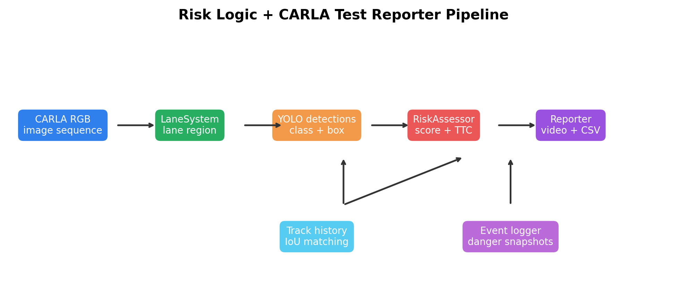
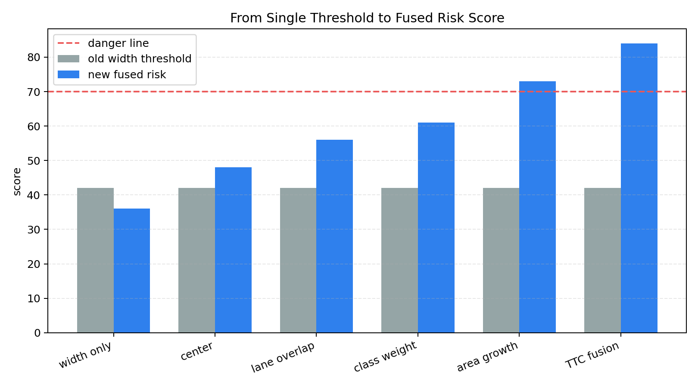
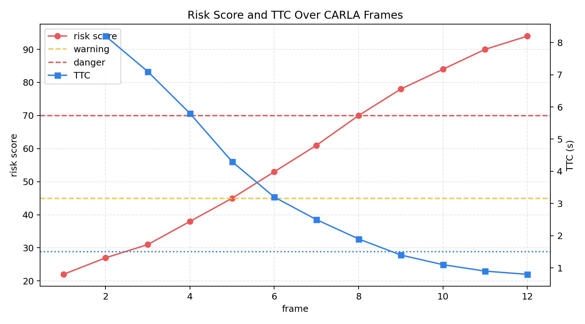
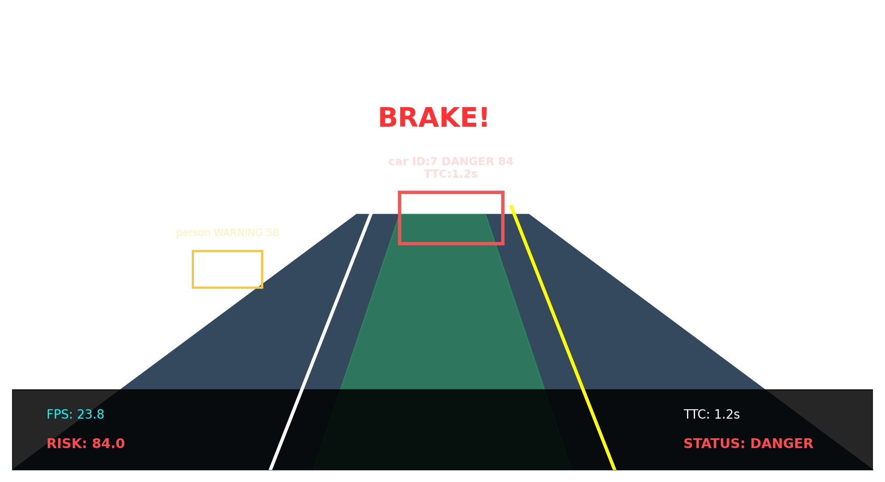

# 危险判断逻辑优化与 CARLA 测试报告模块

本页面用于课程汇报，内容对应 PR [OpenHUTB/nn#6254](https://github.com/OpenHUTB/nn/pull/6254)。该项目围绕自动驾驶视觉辅助系统中的危险判断逻辑展开，将原先较简单的目标框宽度阈值判断，升级为综合风险评分、目标轨迹维护、近似 TTC 估算和 CARLA 图片序列测试报告导出机制。



## 1. 项目背景

原系统已经具备车道线检测、YOLO 目标检测、虚拟仪表盘和危险抓拍能力，但危险判断逻辑主要依赖单个条件：目标框宽度比例是否超过阈值。这种方式实现简单，但容易出现误判。

例如，位于画面边缘的大车可能并不在本车道内，却会因为检测框较宽触发危险；反过来，正前方车辆在连续帧中快速变大时，虽然当前框宽还没有超过阈值，但它已经具有明显接近趋势。对于 CARLA 场景中的连续图片帧，系统也需要能够批量读取、逐帧评估、保存运行视频和 CSV 报告，方便课程作业和 PR 审核展示。

## 2. 原有问题

原危险判断主要使用 `width_ratio > WARNING_RATIO`。这种方法有三个局限：只考虑目标框宽度，没有考虑目标是否位于本车道区域；只看当前帧，没有利用连续帧中目标框变化趋势；无法输出更细致的风险等级，难以区分普通提示、预警和紧急制动。



## 3. 改进方案

本次新增 `RiskAssessor` 模块，负责对 YOLO 检测目标进行综合危险评估。系统不再只依赖目标宽度，而是综合计算 `risk_score`，并将目标风险划分为 `SAFE`、`WARNING`、`DANGER` 三类。

风险评分主要由目标框面积、目标框宽度、画面中心距离、车道区域重叠、目标底部位置、类别权重和 TTC 估算共同决定。其中 TTC 是本次改进的重要部分。系统为目标维护 `track_id`，利用 IoU 将连续帧中的目标匹配起来，然后记录目标框面积随时间变化。当目标框面积持续增长时，系统认为目标正在接近，并根据面积增长率估算近似 TTC。



## 4. CARLA 数据支持

本次项目新增 CARLA 图片序列输入支持。程序可以读取 CARLA `sensor.camera.rgb` 导出的连续图片帧目录，并通过 `--input-kind images` 参数逐帧处理。这样一来，系统不仅可以处理普通视频，也可以处理 CARLA 仿真平台导出的测试数据。

新增的 `CarlaTestReporter` 模块用于保存测试结果，包括带风险标注的视频文件、首帧或关键帧运行截图、危险事件截图、每帧 CSV 风险报告，以及帧号、输入来源、处理进度和报告文件名叠加显示。

## 5. 运行效果

优化后的系统运行界面会显示车道检测结果、目标检测框、目标 ID、风险等级、风险分数和 TTC 信息。不同风险状态使用不同颜色表示：绿色表示安全，黄色表示预警，红色表示危险。

当目标进入本车道区域，并且面积持续变大或 TTC 过小时，系统会进入 `DANGER` 状态，在画面中显示 `BRAKE!`，同时触发危险事件抓拍。底部仪表盘会展示 FPS、偏离指示、虚拟方向盘、`RISK`、`TTC` 和当前系统状态。



## 6. 模块结构

- `LaneSystem`：负责 HLS 颜色过滤、ROI 选取、霍夫线检测、车道线平滑和车道区域生成。
- `RiskAssessor`：负责目标轨迹维护、风险评分和 TTC 估算。
- `EventLogger`：负责危险事件截图保存。
- `FrameSource`：统一视频输入和 CARLA 图片序列输入。
- `CarlaTestReporter`：负责导出视频、截图和逐帧 CSV 报告。

这些模块之间的关系更加清晰：车道系统提供本车道区域，YOLO 提供目标框，风险系统结合空间关系和时序信息计算风险，报告系统负责保存可复现实验结果。

## 7. 算法流程

系统每处理一帧图像，会先读取视频帧或 CARLA 图片帧，然后使用 HLS 颜色阈值提取白线和黄线，通过 Canny 与霍夫变换检测车道线，并平滑历史车道线生成绿色车道区域。随后 YOLO 检测交通目标，风险评估模块用 IoU 将当前帧目标匹配到历史轨迹，计算目标框面积、中心位置、车道重叠、类别权重和底部位置，再根据目标框面积增长估算 TTC，最终输出 `risk_score` 和风险等级。

这种流程相比原来的单阈值判断更加适合自动驾驶场景，因为它同时利用了单帧空间信息和连续帧时序信息。

## 8. 测试方式

PR 中说明的测试环境包括 Windows 10 / Windows 11、Python 3.10、OpenCV、NumPy 和 YOLO 目标检测模块。测试输入包含普通视频文件和 CARLA 前视 RGB 相机导出的连续图片序列。

典型运行方式如下：

```bash
python main.py path/to/carla_rgb_frames --input-kind images --output-dir output --no-display
```

运行后，系统会在 `output/` 目录下保存标注视频、截图和 CSV 报告。CSV 报告记录每一帧的 FPS、系统状态、目标数量、最大风险分数和最小 TTC，便于后续分析和课程展示。

## 9. 项目创新

本项目的创新点主要体现在三个方面。首先，风险判断从单一目标框宽度阈值升级为多因素综合评分。其次，项目引入了基于目标框面积增长的近似 TTC 估算。最后，项目新增了 CARLA 图片序列测试和报告导出能力，把课程项目从“能跑”提升到“能复现、能展示、能审核”。

## 10. 总结

本次项目围绕自动驾驶视觉辅助系统的危险判断逻辑进行了系统性优化。改进后的系统不仅能够检测车道和目标，还能根据目标时序变化估算 TTC，根据目标与车道区域的关系计算综合风险，并将结果以视频、截图和 CSV 报告形式保存下来。

从课程汇报角度看，该项目具有完整的输入、处理、算法、输出和验证流程；从工程实现角度看，它将感知、风险评估和测试报告模块拆分得更清楚，后续可以继续接入更真实的 CARLA 场景、更多目标类别和更精细的车辆控制策略。
