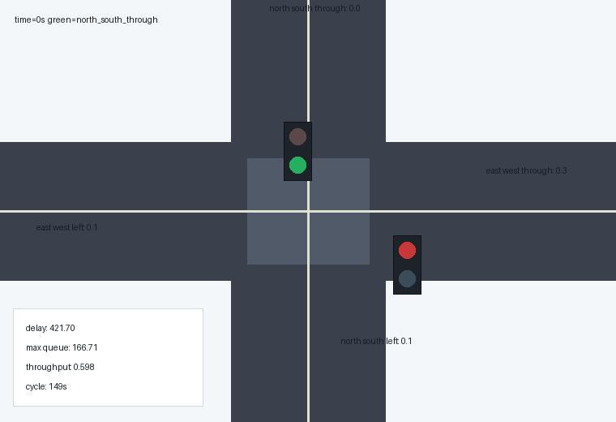
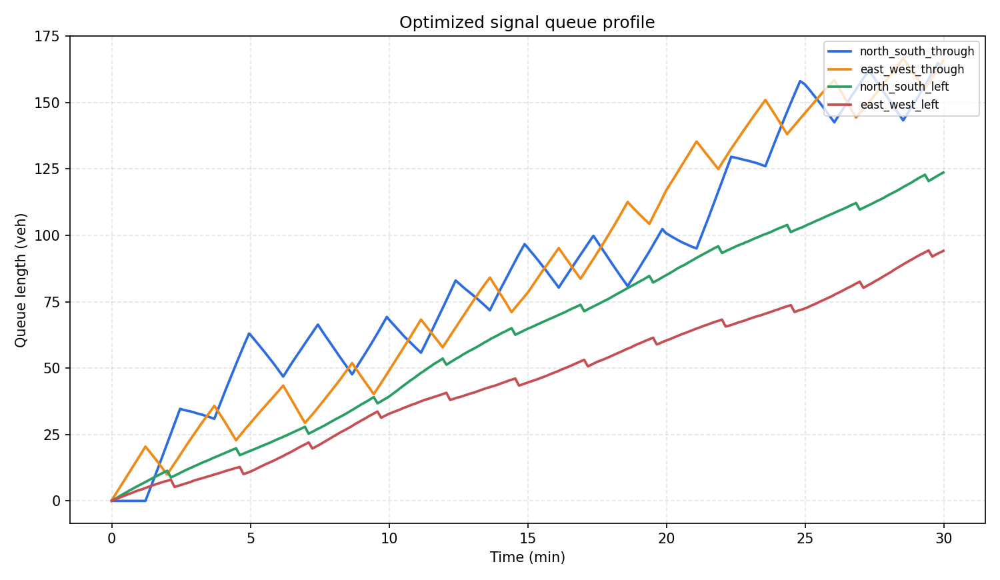

# 城市交叉口信号配时智能优化

本项目面向城市道路交叉口高峰期拥堵问题，构建四相位交通信号仿真环境，并使用遗传算法优化信号周期和各相位绿灯时间。项目以 Webster 固定配时作为基线方案，通过平均延误、最大排队长度、通行率、停车次数和综合评分等指标，对优化效果进行量化分析。

## 项目简介

城市交叉口在早晚高峰中常出现周期固定、绿灯分配不均、车辆排队增长和进口道通行能力不平衡等问题。传统固定配时方案通常依赖历史流量和人工经验，当路口某一方向需求突然增大时，固定周期和固定绿信比很难及时响应，从而造成车辆排队、等待时间增加和通行效率下降。

本项目通过建立简化但可运行的交通流仿真模型，对不同进口方向的车辆到达、排队和放行过程进行模拟。在此基础上，项目使用精英保留遗传算法搜索更优的信号周期和绿信比分配，使信号控制方案能够更贴近实际交通需求。

项目重点不只是展示一个信号灯动画，而是形成完整的工程链路：交通场景建模、基线方案生成、队列仿真、优化算法搜索、指标评估、图表生成、GIF 动图展示和 MkDocs 汇报页面发布。这样的结构便于复现实验，也便于后续扩展到 SUMO、CARLA 或真实交通检测器数据。

## 项目目标

本项目希望解决的问题可以概括为：在一个固定高峰期交通需求场景下，如何自动寻找一组比传统固定配时更合理的信号周期和绿灯时间分配。

具体目标包括：

- 建立四进口、四相位交叉口交通流模型。
- 以 Webster 固定配时方法作为可解释的基线方案。
- 设计队列演化仿真器，按秒模拟车辆到达、等待和放行。
- 构建综合评价指标，衡量延误、排队、停车和通行效率。
- 使用遗传算法自动优化信号周期和绿信比分配。
- 生成图片、动图和数据文件，用于课程汇报和结果分析。
- 将项目说明整理为 MkDocs 文档站，形成可访问的 GitHub Pages 链接。

## 应用背景

在城市道路交通系统中，交叉口往往是通行效率最低、冲突最多的位置。车辆在交叉口处需要根据信号灯周期性停车和启动，如果某一方向绿灯时间不足，会迅速形成排队；如果某一方向绿灯时间过长，又会浪费其他方向的通行机会。

现实交通控制中，常见的固定信号配时存在以下局限：

- 不同时间段交通流量差异明显，固定配时难以适应动态变化。
- 主干道和支路车流强度不同，平均分配绿灯会造成资源浪费。
- 左转相位需求与直行相位需求不同，需要独立考虑。
- 只看总通行量容易忽略某个方向排队过长的问题。
- 只看平均延误容易忽略最大排队长度和停车次数。

因此，一个更合理的信号优化系统需要同时考虑多个指标。本项目采用的综合评分函数将平均延误、最大排队、通行率和停车次数结合起来，避免只优化单一指标导致方案偏向某一方向。

## 项目特点

- 构建四进口交叉口交通仿真场景。
- 包含南北直行、东西直行、南北左转、东西左转四个信号相位。
- 使用 Webster 固定配时作为基线方案。
- 使用遗传算法优化周期长度和绿信比分配。
- 统计平均延误、最大排队、通行率、停车次数和综合评分。
- 自动生成对比图片、收敛曲线、队列曲线和 GIF 动图。
- 提供完整源码、测试文件、运行结果和 MkDocs 汇报页面。

## 文件结构

```text
src/smart_intersection_signal_optimization/
|-- main.py                  # 命令行入口
|-- scenario.py              # 交叉口场景、相位和 Webster 基线
|-- simulator.py             # 队列演化仿真与指标计算
|-- optimizer.py             # 遗传算法配时优化
|-- visualization.py         # 图片、图表和 GIF 生成
|-- requirements.txt         # 依赖说明
|-- README.md                # 项目说明
|-- assets/                  # 运行结果图片、动图和数据
`-- tests/                   # 单元测试
```

## 模块说明

### scenario.py

`scenario.py` 负责定义交叉口场景。项目将一个路口拆分为四个相位，每个相位都有交通需求、饱和流率和优先级。交通需求表示单位小时到达车辆数，饱和流率表示该相位在绿灯期间的最大放行能力，优先级用于区分某些相位的重要程度。

该文件还实现了 Webster 固定配时基线。Webster 方法是交通工程中常见的固定信号配时方法，主要根据交通流率与饱和流率的比例计算周期长度和绿灯分配。将它作为基线，可以让优化算法的效果有一个清晰对照。

### simulator.py

`simulator.py` 是项目的仿真核心。它按秒推进整个路口的运行状态，每一秒会计算车辆到达、当前绿灯相位、可放行车辆数和剩余排队长度。

仿真器输出的结果包括：

- 每个相位在每个时刻的排队长度。
- 每个相位在每个时刻的到达车辆数。
- 每个相位在每个时刻的放行车辆数。
- 当前激活的信号相位。
- 平均延误、最大排队、通行率、停车次数和综合评分。

### optimizer.py

`optimizer.py` 实现遗传算法。项目将一个信号配时方案编码为一个个体，其中包含周期长度和四个相位的绿灯权重。算法通过多代迭代，不断保留较优方案，并通过交叉和变异生成新的候选方案。

遗传算法相比穷举搜索更适合本项目，因为周期长度和绿信比分配组合较多，完全枚举会增加计算成本。遗传算法能够在有限代数内快速找到较优方案，并保留一定随机探索能力。

### visualization.py

`visualization.py` 负责生成所有展示材料，包括绿信比分配对比图、指标对比图、队列曲线图、遗传算法收敛曲线和交叉口运行 GIF 动图。

这些可视化结果可以帮助读者直观看到优化方案的效果。例如，绿信比分配图可以显示算法是否给高需求方向分配了更多绿灯时间；队列曲线可以展示排队长度是否随时间持续增长；收敛曲线可以说明遗传算法是否稳定下降。

### main.py

`main.py` 是命令行入口。运行该文件后，程序会依次创建场景、运行基线方案、执行遗传算法优化、生成图表、保存指标文件并打印实验摘要。

## 运行方法

```bash
cd src/smart_intersection_signal_optimization
python main.py
```

运行后会在 `assets/` 目录下生成：

```text
optimized_queue_profiles.png          # 优化后各进口排队曲线
green_split_comparison.png            # 基线与优化绿信比分配对比
metric_comparison.png                 # 延误、排队、停车、综合评分对比
ga_convergence.png                    # 遗传算法收敛曲线
intersection_signal_optimization.gif  # 信号控制与排队动态演示
metrics.json                          # 汇总指标
optimized_greens.csv                  # 优化绿灯时间表
convergence.csv                       # 每代优化过程
```

## 核心流程

1. 构建四相位交叉口交通需求场景。
2. 根据 Webster 方法生成固定配时基线。
3. 使用队列演化模型模拟车辆到达、排队和放行。
4. 将信号周期和绿信比分配编码为遗传算法个体。
5. 通过选择、交叉、变异和精英保留迭代搜索更优方案。
6. 对比基线方案和优化方案的交通运行指标。
7. 输出图片、GIF、CSV、JSON 和文档汇报页面。

## 交通流模型设计

本项目采用离散时间队列模型。仿真时间被划分为一秒一个时间步，在每个时间步内，每个相位都会根据设定的交通需求生成到达车辆。为了使交通流更接近实际情况，车辆到达并不是完全固定的，而是加入了周期波动和轻微随机扰动。

每个相位的排队长度按照下面的思路更新：

```text
当前排队 = 上一秒排队 + 当前到达车辆 - 当前放行车辆
```

如果当前相位处于绿灯，则可以按照饱和流率放行车辆；如果当前相位不是绿灯，则放行能力为零。为了避免出现负数排队，最终排队长度会被限制为非负值。

这种模型虽然比专业交通仿真平台简单，但具备三个优点：

- 可以直接在普通 Python 环境运行，便于课程提交。
- 指标计算过程透明，便于解释优化效果。
- 与遗传算法结合方便，适合快速评估大量候选方案。

## 信号相位设计

项目使用四相位信号控制：

| 相位名称 | 含义 | 设计目的 |
| --- | --- | --- |
| north_south_through | 南北直行 | 服务主方向直行交通 |
| east_west_through | 东西直行 | 服务次方向直行交通 |
| north_south_left | 南北左转 | 单独处理左转冲突 |
| east_west_left | 东西左转 | 单独处理东西向左转需求 |

相位拆分的意义在于：直行和左转的交通需求、饱和流率和冲突关系并不相同。如果将所有方向简单合并，会掩盖左转车辆排队问题。单独设置左转相位可以使优化算法更细致地分配绿灯资源。

## Webster 基线方案

Webster 固定配时方法根据交通流率和饱和流率的比例计算周期与绿灯时间。它的优点是简单、可解释、工程上常见，适合作为基线方案。

本项目使用 Webster 方案的目的不是证明它不好，而是提供一个合理参照。如果遗传算法方案能够在相同交通需求下获得更低综合评分，就说明智能优化具有一定价值。

基线方案的作用包括：

- 提供固定配时下的平均延误。
- 提供固定配时下的最大排队长度。
- 提供优化前后绿信比分配差异。
- 避免只展示优化方案而缺少对照。

## 遗传算法设计

遗传算法模拟自然选择过程。每个个体代表一个信号配时方案，包含周期长度和各相位绿灯权重。算法会先生成一组初始方案，然后重复执行评估、选择、交叉和变异。

项目中的遗传算法具有以下步骤：

1. 初始化种群，其中包含 Webster 基线附近的方案和随机方案。
2. 将每个个体转换为实际信号计划。
3. 调用仿真器计算每个计划的综合评分。
4. 按评分排序，保留表现较好的精英个体。
5. 从精英个体中选择父代，通过交叉生成子代。
6. 对子代进行小幅随机变异，扩大搜索空间。
7. 重复多代，记录每一代的最佳评分。

遗传算法的优势在于它不要求目标函数可导，也不需要复杂数学推导。只要仿真器能够给出评分，算法就可以不断搜索更好的方案。

## 个体编码方式

每个个体可以理解为一个长度为 5 的向量：

```text
[cycle_length, g1, g2, g3, g4]
```

其中 `cycle_length` 表示信号周期长度，`g1` 到 `g4` 表示四个相位的绿灯权重。程序会将这些权重归一化，使各相位绿灯时间之和满足周期约束。

例如，一个候选方案可能表示为：

```text
cycle_length = 120
north_south_through = 0.45
east_west_through = 0.30
north_south_left = 0.15
east_west_left = 0.10
```

这表示在 120 秒周期内，南北直行获得更多绿灯资源，东西左转获得较少绿灯资源。最终绿灯秒数会根据总可用绿灯时间进行换算。

## 目标函数设计

本项目的目标函数不是单纯最小化某一个指标，而是综合多个交通运行指标：

```text
score = average_delay + 0.75 * max_queue + 16 * (1 - throughput) + 1.8 * stops_per_step
```

各项含义如下：

- `average_delay`：平均延误，表示车辆等待成本。
- `max_queue`：最大排队长度，表示拥堵峰值和溢出风险。
- `throughput`：通行率，表示车辆通过能力。
- `stops_per_step`：单位时间停车强度，表示驾驶舒适性和能耗影响。

综合目标函数的好处是平衡不同目标。如果只优化平均延误，算法可能让某个低流量方向长期等待；如果只优化最大排队，又可能牺牲整体通行效率。综合评分能够让结果更加稳健。

## 动态演示

下图展示了优化配时下交叉口各方向车辆排队随信号相位变化的过程。



动图中的道路和车辆队列用于直观呈现信号切换过程。不同颜色表示不同方向或相位，车辆条带数量反映当前排队压力。通过动图可以看到，当某一方向获得绿灯时，该方向排队会逐渐减少；当方向处于红灯时，排队会继续增长。

## 实验结果

### 绿信比分配对比


绿信比对比图展示了基线方案和优化方案在各个相位上的绿灯时间差异。通常情况下，高需求方向会获得更长绿灯时间，而低需求方向会保持最低可接受绿灯。该图可以说明遗传算法不是随机给出结果，而是根据交通压力重新分配通行资源。

### 指标对比


指标对比图展示了优化前后的平均延误、最大排队、停车次数和综合评分。若优化方案的综合评分下降，说明算法在多个指标之间取得了更好的平衡。

### 优化后排队曲线



排队曲线展示各进口方向随时间变化的排队长度。如果某条曲线持续上升，说明该方向绿灯时间不足；如果曲线在一定范围内波动，说明信号控制基本能够消化车辆到达。通过曲线可以观察优化方案是否存在明显短板。

### 遗传算法收敛曲线


收敛曲线展示遗传算法在多代搜索中的最佳评分变化。若曲线逐步下降并趋于稳定，说明搜索过程有效。该图也能体现项目并非只运行一次固定公式，而是进行了迭代优化。

## 运行结果示例

```text
Smart intersection signal optimization finished
Algorithm: elitist genetic algorithm
Baseline delay: 434.538
Optimized delay: 421.7
Delay reduction: 2.954%
Score reduction: 14.175%
Optimized cycle: 149s
```

从示例结果可以看到，优化后的平均延误有所下降，综合评分下降更加明显。这说明遗传算法不只是在一个指标上做微小调整，而是在排队峰值、停车次数和通行效率之间做了综合权衡。

## 输出数据说明

项目除了图片和 GIF，还会生成结构化数据文件，便于复查和二次分析。

### metrics.json

`metrics.json` 保存最终汇总指标，包括基线方案、优化方案、提升比例、优化后绿灯时间和输出文件路径。它适合用于自动检查项目结果，也可以作为后续网页展示的数据来源。

### optimized_greens.csv

`optimized_greens.csv` 保存每个相位的优化绿灯秒数。该文件可以直接用于表格展示，也便于和人工配时方案进行对比。

### convergence.csv

`convergence.csv` 保存遗传算法每一代的最佳评分、平均延误和最大排队长度。该文件可以用于绘制收敛曲线，也可以用于分析算法是否过早收敛。

## 测试设计

项目包含基础单元测试，用于验证关键逻辑是否正确。测试重点包括：

- 场景是否包含四个相位。
- 信号计划归一化后是否满足周期约束。
- Webster 基线方案是否可以正常仿真。
- 基因编码能否转换为合法信号计划。
- 小规模遗传算法优化结果是否不差于基线评分。

测试文件位于：

```text
src/smart_intersection_signal_optimization/tests/test_signal_optimization.py
```

测试的意义在于保证项目不是只有展示页面，而是包含可验证的工程逻辑。即使后续调整算法参数，也可以通过测试快速发现基本功能是否被破坏。

## 与普通演示项目的区别

很多交通灯演示项目只展示红绿灯切换动画，缺少真实优化过程。本项目的区别在于：

- 有交通流需求建模。
- 有固定配时基线作为对照。
- 有可运行的队列仿真器。
- 有智能优化算法搜索过程。
- 有量化指标和图表输出。
- 有测试文件和结构化数据文件。
- 有 GitHub Pages / MkDocs 汇报页面。

因此，本项目更接近一个完整的小型智能交通优化系统，而不是单纯的页面展示。

## 局限性分析

由于课程项目需要保证可运行性和可复现性，本项目没有直接接入大型交通仿真平台，因此仍存在一些简化：

- 车辆到达过程采用简化随机模型，没有使用真实检测器数据。
- 交叉口只包含四个相位，没有加入行人和非机动车。
- 车辆排队模型未考虑车道长度和溢出阻塞。
- 放行能力用饱和流率近似，没有模拟车辆跟驰细节。
- 遗传算法参数未进行大规模调参。

这些简化不会影响项目展示优化思想，但如果用于真实交通控制，还需要引入更复杂的交通流模型和实测数据。

## 后续可扩展方向

- 将遗传算法替换为 DQN、PPO 或多智能体强化学习。
- 接入 SUMO、CARLA 或真实交通检测器数据。
- 增加行人相位、公交优先和应急车辆优先策略。
- 从单路口扩展到多路口区域协调控制。
- 加入早晚高峰动态需求变化，实现自适应信号控制。
- 引入排队溢出惩罚，避免某一进口道排队超过路段容量。
- 对比粒子群算法、模拟退火算法和贝叶斯优化算法。
- 在网页中加入交互式参数调节，使用户可以改变交通需求并重新观察结果。

## 总结

本项目围绕城市交叉口信号配时优化，完成了从问题建模到网页汇报的完整流程。项目首先构建四相位交通流仿真环境，然后使用 Webster 方法生成固定配时基线，再通过遗传算法搜索更优信号周期和绿信比分配。最后，项目生成多种可视化结果，并通过 MkDocs 文档站进行展示。

从工程角度看，项目包含多个独立模块，覆盖场景定义、仿真计算、智能优化、结果分析、可视化生成和测试验证。从汇报角度看，项目提供了图片、动图、指标表和文字说明，能够较完整地展示优化思路与实验结果。

该项目后续可以继续扩展为强化学习信号控制、多路口协调优化或基于真实交通数据的自适应信号控制系统。
