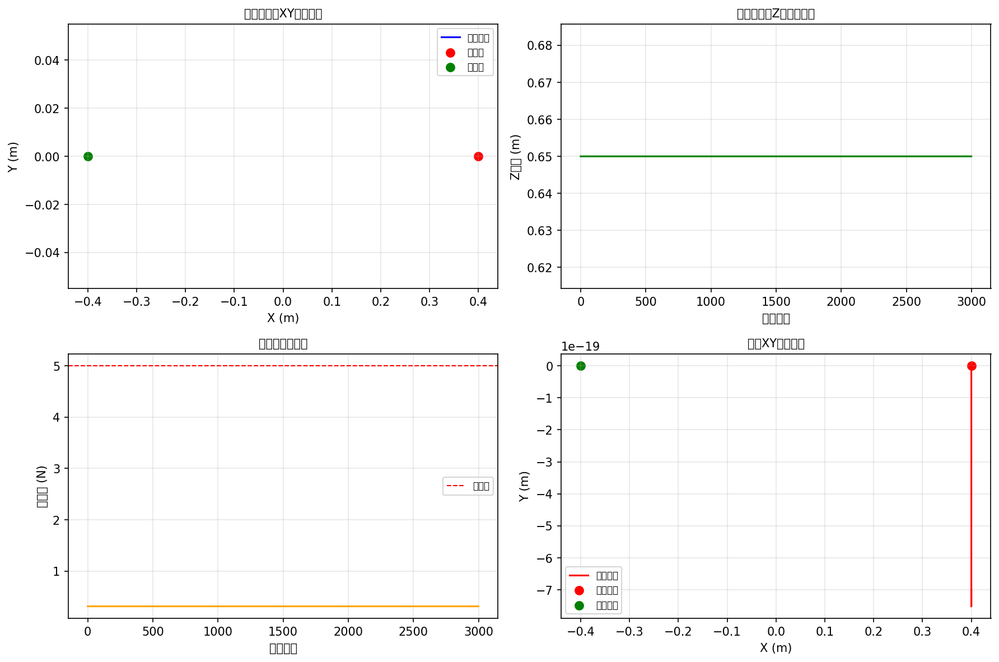

# 机械臂抓取仿真项目（MuJoCo）
Robot Arm Grasping Simulation (MuJoCo)

<div align="center">
  
</div>

## 项目概述
本项目基于 **MuJoCo 2.3.6** 物理仿真引擎实现3自由度机械臂抓取任务，聚焦典型物体的精准抓取、姿态规划及力反馈控制，可直接用于机器人抓取算法的验证与调试。

### 核心应用场景
- 📦 **单物体精准抓取**：从固定位置抓取立方体，放置到指定目标坐标
- 📊 **力反馈控制**：基于末端力传感器数据，自适应调整夹爪夹持力度
- 🎯 **轨迹可视化**：生成末端执行器/物体的运动轨迹、接触力变化等分析图表

## 环境配置（Windows 一键部署）
### 1. 激活虚拟环境
```bash
# 打开PowerShell，进入项目根目录
cd D:\nn

# 激活虚拟环境
D:\nn\.venv\Scripts\activate