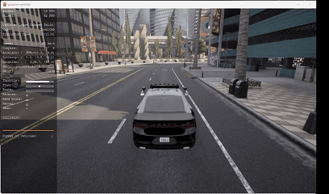

# Carla 键盘控制车辆

通过键盘手动控制 CARLA 仿真环境中的车辆运行，对应课程任务（1）物理仿真 + 键盘运动控制。

## 运行环境

- Windows 主机（运行 Carla 仿真器）
- Ubuntu 20.04 + Python 3.8（Conda 环境）
- Carla/OpenHUTB 2.9.16

## 依赖安装

    conda create -n carla38 python=3.8 -y
    conda activate carla38
    pip install /path/hutb-2.9.16-cp38-cp38-linux_x86_64.whl
    pip install numpy pygame

如果 `import carla` 报 `undefined symbol` 错误，需要设置：

    export LD_PRELOAD=/home/user/miniconda3/envs/carla38/lib/libc++.so.1:/home/user/miniconda3/envs/carla38/lib/libc++abi.so.1

## 运行步骤

1. Windows 主机启动 Carla 仿真器：

       cd D:\WWW\hutb_car_vr_air_mujoco
       .\CarlaUE4.exe

2. Ubuntu 虚拟机运行控制脚本：

       cd src/carla_manual_control
       python main.py --host=192.168.56.1 --port=2000

或通过 launch 启动：

       roslaunch carla_manual_control main.launch host:=192.168.56.1

## 操作说明

| 按键 | 功能 |
| W | 油门加速 |
| S | 刹车 |
| A/D | 左/右转向 |
| Q | 倒车 |
| 空格 | 手刹 |
| P | 自动驾驶 |
| ESC | 退出 |

## 运行效果

左侧 HUD 实时显示速度、油门、转向、刹车等状态。
