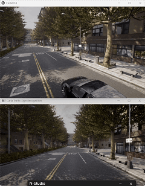

# Carla Traffic Sign Recognition

基于 Carla 仿真器 + YOLOv8 神经网络的交通标志识别与车辆控制模块。

## 功能

- 在 Carla 仿真环境中生成自车并安装 RGB 摄像头
- 使用 YOLOv8n 神经网络对摄像头画面进行实时目标检测
- 识别交通标志（COCO 类别 11: stop sign）
- 支持键盘控制车辆运动（W/A/S/D/Q）
- OpenCV 实时显示摄像头画面与检测结果

## 运行环境

- Windows 10/11（Carla 服务端与客户端均在本机运行）
- Python 3.10.11
- Carla/HUTB 2.9.16
- PyTorch 2.14.0 (CPU)
- Torchvision 0.29.0 (CPU)
- Ultralytics 8.4.160
- OpenCV 5.0.0
- NumPy 2.2.6

## 依赖安装

    py -3.10 -m venv D:\WWW\venv_carla310
    D:\WWW\venv_carla310\Scripts\activate
    pip install hutb-2.9.16-cp310-cp310-win_amd64.whl
    pip install torch torchvision --index-url https://download.pytorch.org/whl/cpu --no-deps
    pip install ultralytics opencv-python pillow -i https://pypi.tuna.tsinghua.edu.cn/simple

## 运行步骤

1. 启动 Carla 服务端：

       cd D:\WWW\hutb_car_vr_air_mujoco
       .\CarlaUE4.exe

2. 下载 YOLOv8n 权重 yolov8n.pt（约 6MB），放到本模块目录下。

3. 运行主程序：

       python main.py

   或直接双击 main.bat。

## 键盘操作

| 按键 | 功能 |
|---|---|
| W | 油门前进 |
| S | 刹车 / 倒车 |
| A | 左转 |
| D | 右转 |
| Q | 退出 |

需先点击 OpenCV 窗口 Carla Traffic Sign Recognition 激活键盘焦点。

## 神经网络原理

YOLOv8 为单阶段目标检测网络，将目标检测转化为回归问题，直接在特征图上预测边界框和类别。

损失函数：

    L = lambda_box * L_CIoU + lambda_cls * L_BCE + lambda_dfl * L_DFL

推理输出：对于输入图像 I，网络输出 N 个检测结果，每个包含 (cx, cy, w, h, confidence, class_prob)。

## 算法流程

1. Carla 服务端启动，客户端连接 127.0.0.1:2000
2. 生成自车，随机选 spawn 点
3. 在自车前上方 (x=1.5, z=2.4) 挂载 RGB 摄像头，分辨率 640x360，FOV 90
4. 摄像头回调：将 Carla 图像转为 numpy 数组
5. 每 4 帧执行一次 YOLOv8 推理，仅检测类别 11（stop sign）
6. 检测结果用 results[0].plot() 绘制到画面上
7. OpenCV 窗口显示带检测框的画面，同时捕获键盘输入
8. 键盘输入映射为 carla.VehicleControl 并应用到车辆

## 演示

## 注意事项

- 使用 127.0.0.1:2000 连接本机 Carla 服务端
- YOLO 降频推理，避免主循环卡顿
- OpenCV 窗口需点击激活键盘焦点
