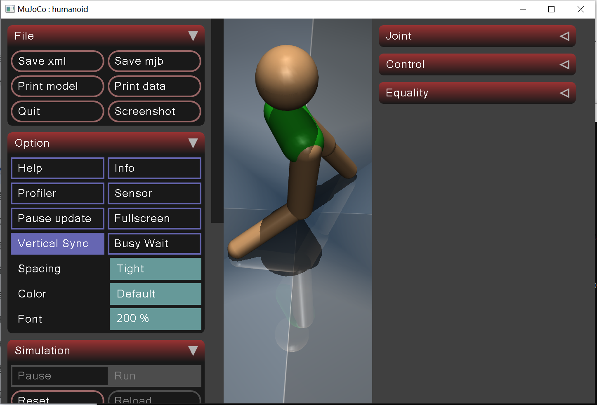

# USD-2023Z
Reinforcement learning with MuJoCo simulator. Requires Python version >= 3.8.

## 安装 (Installation)

### Linux

```bash
python -m venv ./venv
source venv/bin/activate
pip install -r requirements.txt
```

1. 如果在 Windows 上使用，可能需要安装 Visual C++ Build Tools：https://visualstudio.microsoft.com/pl/visual-cpp-build-tools/
2. 如果 CUDA 驱动版本不是 >12.0，请从 https://pytorch.org/get-started/locally/ 手动安装 PyTorch

## 训练 (Train)

使用 SAC 算法训练 Humanoid 模型：

```bash
python train.py
```

## 测试 (Tests)

```bash
python test.py --load-model trained_models/mujoco_trained
# 或
python test.py --load-model trained_models/mujoco_trained --env-type pybullet
```

### 仿真结果 (MuJoCo)

